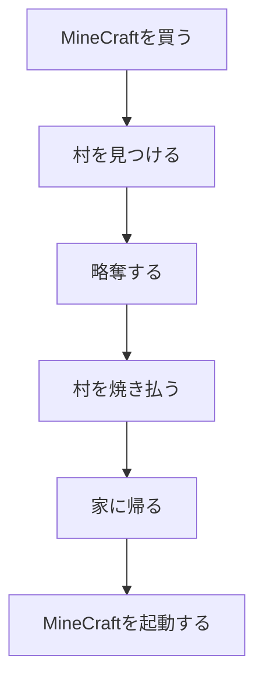

<kbd><kbd><kbd><kbd><kbd><kbd>
<kbd><kbd><kbd><kbd><kbd><kbd><kbd><kbd><kbd><kbd><kbd><kbd><kbd><kbd><kbd><kbd><kbd><kbd><kbd><kbd>
Hello
</kbd></kbd></kbd></kbd></kbd></kbd></kbd></kbd></kbd></kbd></kbd></kbd></kbd></kbd></kbd></kbd></kbd></kbd></kbd></kbd>
<kbd><kbd><kbd><kbd><kbd><kbd><kbd><kbd><kbd><kbd><kbd><kbd><kbd><kbd><kbd><kbd><kbd><kbd><kbd><kbd>
World
</kbd></kbd></kbd></kbd></kbd></kbd></kbd></kbd></kbd></kbd></kbd></kbd></kbd></kbd></kbd></kbd></kbd></kbd></kbd></kbd>
</kbd></kbd></kbd></kbd></kbd></kbd>

